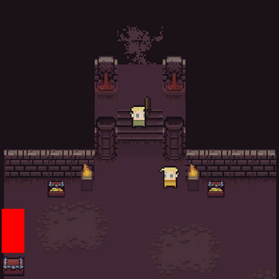

# Action RPG with Custom 2D Physics

This project is an action RPG game implemented using custom 2D physics, providing a unique gameplay experience with intricate physics-based interactions and combat.



## Try It Out

You can try the project [here](https://hk-studio.itch.io/the-rpg).

## Features

- Custom 2D physics engine for unique interactions.
- Engaging action RPG gameplay.
- Dynamic combat system and immersive world.

## How to Run

1. Clone the repository:
   ```sh
   git clone https:https://github.com/hussienK/Unity-Action-RPG.git
   cd Unity-Action-RPG
2. Open the project in Unity:
   ```sh
   - Launch the Unity Hub.
   - Add the project to your Unity Hub.
   - Open the project in the Unity Editor.
3. Play the scene:
   ```sh
   - In the Unity Editor, open the main scene.
   - Click the "Play" button to start the game.
Or try the executable from the website

## Contribution

Contributions are welcome! If you have suggestions or improvements, feel free to open an issue or submit a pull request.
